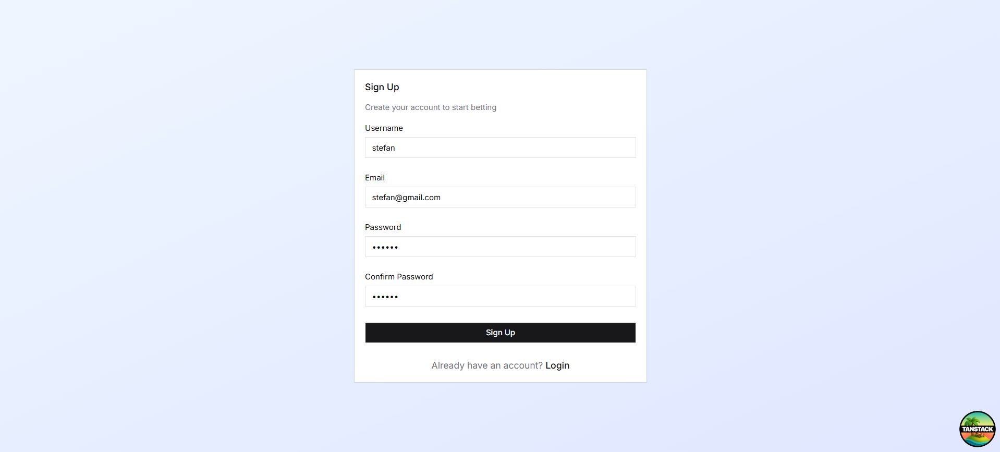
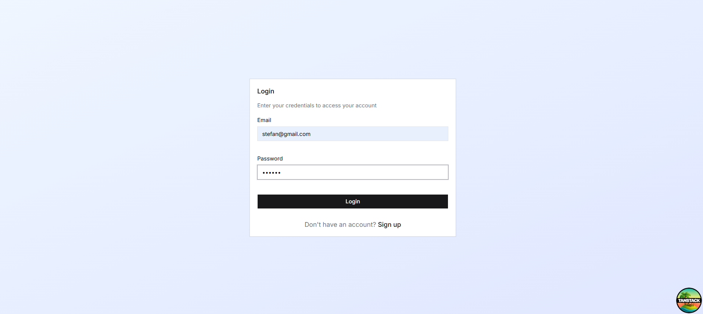
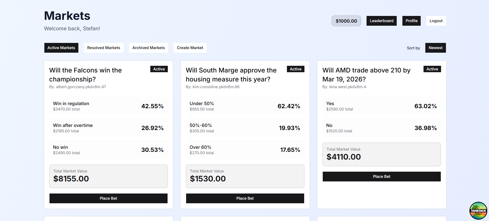
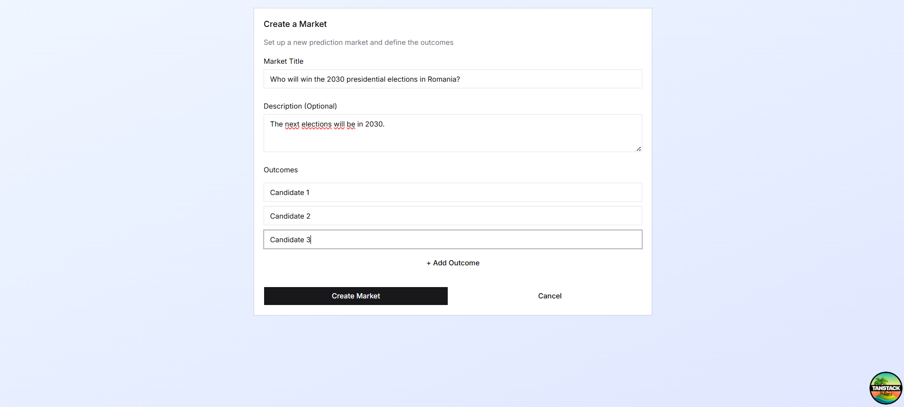
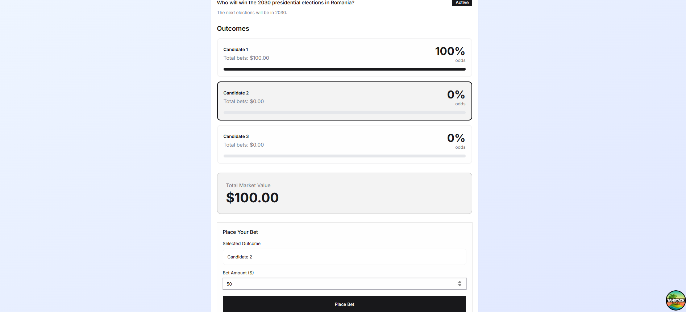
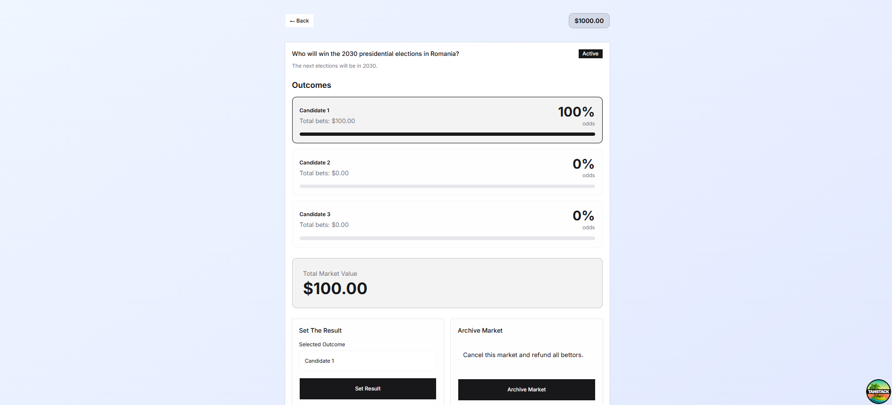
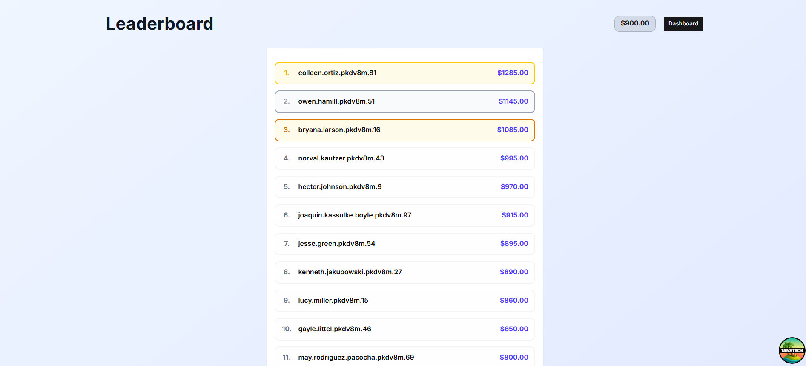
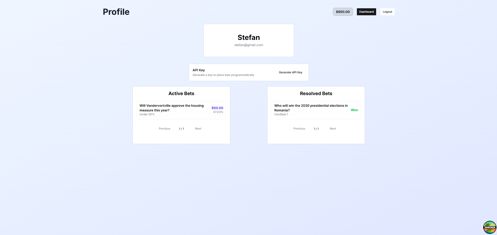

# Submission

## Short Description

A full-stack prediction markets application where users can create markets, place bets on outcomes, and earn winnings based on proportional stake distribution.

## Getting Started

Create a `.env` file inside the `/server` directory with the following content:

```env
DB_FILE_NAME=database.sqlite
JWT_SECRET=<YOUR_JWT_SECRET>
HOST=127.0.0.1
PORT=4001
ADMIN_USERNAME=<YOUR_ADMIN_USERNAME>
ADMIN_PASSWORD=<YOUR_ADMIN_PASSWORD>
ADMIN_EMAIL=<YOUR_ADMIN_EMAIL>
```

**Running with Docker**

```bash
docker-compose up -d
```

**Running manually**

```bash
cd server/ && bun install && bun run dev
cd client/ && bun install && bun run dev
```

---

## Design Choices

- **Server-Sent Events** — chosen over WebSockets because all real-time communication is unidirectional. The server notifies clients when events occur and clients respond via standard REST requests, making SSE a more appropriate and lightweight fit.
- **Database transactions for critical operations** — bet placement and market resolution involve multiple steps that must be atomic. Transactions ensure that if any step fails, no partial state is persisted.
- **Reusing the provided project template** — the existing folder structure, tooling and conventions were preserved throughout development to maintain consistency with the initial setup.

---

## Challenges

- **Security considerations** — API keys introduce inherent risks if exposed or lost. To mitigate this, the system is designed so that generating a new API key automatically revokes the previous one, allowing users to quickly invalidate compromised credentials.
- **SSE vs WebSockets** — evaluating which real-time technology to use required understanding the communication pattern of the application. Since data only flows from server to client, SSE was the correct choice, but the decision required understanding the trade-offs between the two approaches.
- **Data consistency across page refreshes** — user balance changes frequently and could not be stored statically in localStorage. Solving this required a dedicated endpoint to fetch fresh user data on mount and after every balance-affecting action, with localStorage used only to prevent visual flickering.

---

## Images

## Authentication

**Register**



**Login**



## Dashboard

**Main Dashboard**

Markets can be filtered by status — **Active**, **Resolved**, or **Archived** — and sorted by **Creation Date**, **Total Bet Size**, or **Number of Participants** in ascending or descending order.
Results are paginated, displaying **20 Markets per Page**, with navigation controls that allow users to move between pages.



**Create Market**



**Place Bet**



**Admin Place Bet Page**

On this page, an admin can set the final outcome for a market or archive a market. Once an outcome is determined, all user balances are updated in real time using **Server-Sent Events (SSE)**.



## Leaderboard

**Leaderboard Page**



## Profile

**Profile Page**

Here, users can generate an API key to place bets programmatically using bots. The key can be created by clicking the **Generate API Key** button. For security reasons, any previously generated API key is automatically revoked when a new one is created.

